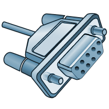
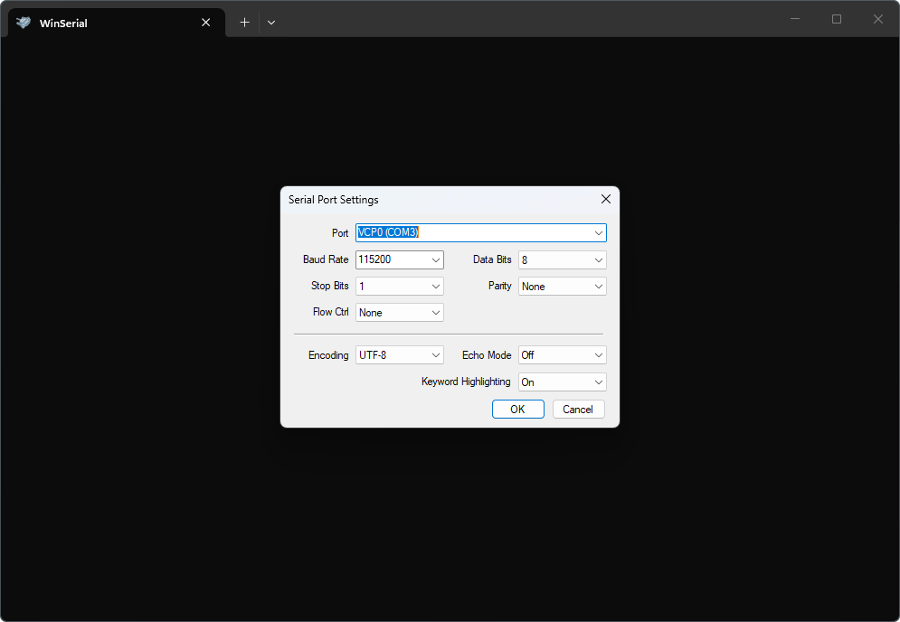

# WinSerial



A tool for connecting to a serial port for Windows, which can be integrated as a tab in the Windows Terminal.

## Features

* **Windows Terminal Integration**: Seamlessly runs as a native tab within Windows Terminal for a modern and unified command-line experience.
* **Auto Keyword Highlighting**: Automatically detects and colorizes crucial information in the serial data stream to significantly improve readability:
  * **Red**: Errors and warnings (e.g., `error`, `failed`, `shutdown`).
  * **Green**: Success and operational statuses (e.g., `enabled`, `connected`, `ok`).
  * **Yellow/Cyan/Magenta**: Network identifiers (IPs, MAC addresses) and system configuration terms.
* **On-the-Fly Hotkeys**: Quickly manage your active session using convenient shortcuts (press `Ctrl + A` to enter command mode, then press `Ctrl + C` to toggle encoding, `Ctrl + E` for echo mode, or `Ctrl + H` for the help menu).
* **High Performance & Stability**: Built with C++ and utilizes the `boost::asio` library for reliable, asynchronous serial port communication.
* **Smart Configuration Management**: Automatically saves your serial port settings (Baud Rate, Stop Bits, Word Length, etc.) to the Windows Registry, remembering your preferences for the next session.
* **Easy Installation**: Available as a portable application or a fully automated installer (`WinSerial-setup.exe`) that configures your system `PATH` and adds the WinSerial profile directly to your Windows Terminal settings.


## Usage

### Installation

Choose one of the following installation methods that best suits your needs:

#### **Installer (Recommended)**

1. Download and install the latest [Windows Terminal](https://github.com/microsoft/terminal/releases) or from Microsoft Store.
2. Download and run the latest WinSerial installer (`WinSerial-setup.exe`) from the [Releases](https://github.com/bs135/WinSerial/releases) page.
3. Open Windows Terminal and launch a new **WinSerial** tab, or simply run the `WinSerial` command in PowerShell or Command Prompt.

#### **Portable**

1. Download the latest portable package (`WinSerial-portable.zip`) from the [Releases](https://github.com/bs135/WinSerial/releases) page.
2. Extract the archive and run `WinSerial.exe`.

### Connecting to a Serial Port

When launching WinSerial (either standalone or via Windows Terminal), a configuration dialog prompts you to set up the connection parameters:



* **Port:** Select the target COM port from the dropdown menu.
* **Baud Rate:** Choose the communication speed (e.g., `9600`, `115200`).
* **Data Bits, Stop Bits, Parity, Flow Control:** Configure these settings based on your target device's specifications.
* **Keyword Highlighting:** Enable or disable automatic keyword color highlighting (e.g., green for successes, red for errors).
* **Encoding:** Select `UTF-8` or `GBK` to ensure proper character rendering.
* **Echo Mode:** Toggle local echo `On` or `Off`.

Click **OK** to establish the connection and launch the terminal session.

---

### Hotkeys

WinSerial features built-in hotkeys for on-the-fly configurations during an active session.

**Note:** You must press `Ctrl+A` first to enter **Command Mode**, followed by one of the action keys below:

* `Ctrl+A, Ctrl+F`: Toggle automatic Keyword Highlighting (`On` / `Off`).
* `Ctrl+A, Ctrl+C`: Toggle console encoding format (switches between `UTF-8` and `GBK`).
* `Ctrl+A, Ctrl+E`: Toggle local Echo mode (`On` / `Off`).
* `Ctrl+A, Ctrl+I`: Display application version and information dialog.
* `Ctrl+A, Ctrl+H`: Display the help menu.
* `Ctrl+A, Ctrl+X`: Safely disconnect and exit the application.

## Development

### Prerequisites

To build WinSerial from source, ensure you have the following components installed and configured:

1. **Visual Studio 2022**

    * Install the **"Desktop development with C++"** workload via the [Visual Studio Installer](https://visualstudio.microsoft.com/vs/older-downloads/#visual-studio-2022-and-other-products).
    * This workload includes the required MSVC compiler (`cl.exe`) and the necessary Windows SDK.
    * **Important:** Always build the project using the **"Developer Command Prompt for VS"** or **"Developer PowerShell for VS"** to ensure the build environment variables (like compiler paths) are correctly initialized.

2. **Install CMake**

    * Download and install from [cmake.org](https://cmake.org/download/).
    * Ensure the `bin` directory of your CMake installation (e.g., `C:\Path\to\cmake\bin`) is added to your system `PATH`.

3. **Install vcpkg**

    * Follow the official [vcpkg getting started guide](https://learn.microsoft.com/en-us/vcpkg/get_started/get-started?pivots=shell-powershell).
    * Initialize vcpkg:

        ```powershell
        git clone https://github.com/microsoft/vcpkg.git
        cd vcpkg
        .\bootstrap-vcpkg.bat

        ```

    * Ensure the `vcpkg` directory (e.g., `C:\Path\to\vcpkg`) is added to `VCPKG_ROOT` and to your system `PATH`.

### Build Instructions

1. **Clone the repository**

    ```powershell
    git clone https://github.com/bs135/WinSerial.git
    cd WinSerial

    ```

2. **Build the project**

    ```powershell
    mkdir build
    cd build
    cmake .. -DCMAKE_TOOLCHAIN_FILE="C:/Path/to/vcpkg/scripts/buildsystems/vcpkg.cmake" -DCMAKE_BUILD_TYPE=Release
    cmake --build . --config Release

    ```

3. **Run the application**

    ```powershell
    .\Release\WinSerial.exe

    ```

## License

This project is licensed under the Apache License Version 2.0. See the `LICENSE` file for more details.

## Acknowledgements

This project is a fork of [SerialPortForWindowsTerminal](https://github.com/Zhou-zhi-peng/SerialPortForWindowsTerminal).
Many thanks to the original author for the excellent foundation.

The application icon is sourced from [Wikimedia Commons](https://commons.wikimedia.org/wiki/File:VSPD_Icon.png).
